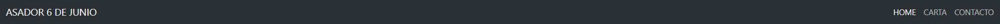

# Restaurante asador

Este es un proyecto el cual esta realizado para el curso fsd de GeeksHubs. En dicho proyecto vamos a estar viendo una pagina web la cual va a constar de una pantalla inicial (Home), otra pantalla llamada "Menu" y por último "Contacto".

## Tecnologías utilizadas
---

En este caso hemos utilizado las siguientes tecnologías: 

* HTML 
* CSS
* Bootstrap
---

### Ejemplo de tecnologías 

Hemos utilizado bootstrap para practicamente todo ya que es muy comodo de utilizar. Lo mas notorio ha sido el navbar el cual gracias a bootstrap te evitas muchos quebraderos de cabeza. Aqui teneis una captura de dicho navbar:

A su vez hemos estado utilizando CSS, no tanto como bootstrap pero el justo y necesario sobretodo para encargarnos de colocar todo en su sitio.

---

### Capturas del proyecto

Aqui teneis la página "Home" con unas cuantas fotografias las cuales representan el restaurante y un texto con su historia:

Depues tendriamos la página "Carta" el cual al hacer scroll la veriamos en su totalidad:

Y por último la pagina "Contacto" donde se encuentra la información de los diferentes restaurantes:

---

### Agradecimientos

Quiero agradecer a mis compañeros, a todo el profesorado, por ser tan pacientes conmigo y ayudarme tanto. A su vez quiero agradecer a mi amigo Adrian quien al terminar su jornada laboral no ha dudado ni un segundo en prestarme su apoyo en este proyecto el cual ha supuesto un verdadero reto para mi.

--- 

### Wiki

* Practicamente todas las imagenes han sido sacadas de la web del restaurante 7 de Julio: https://www.asador7dejulio.com/

* La estructura del proyecto esta inspirada en la web del restaurante 7 de Julio: https://www.asador7dejulio.com/